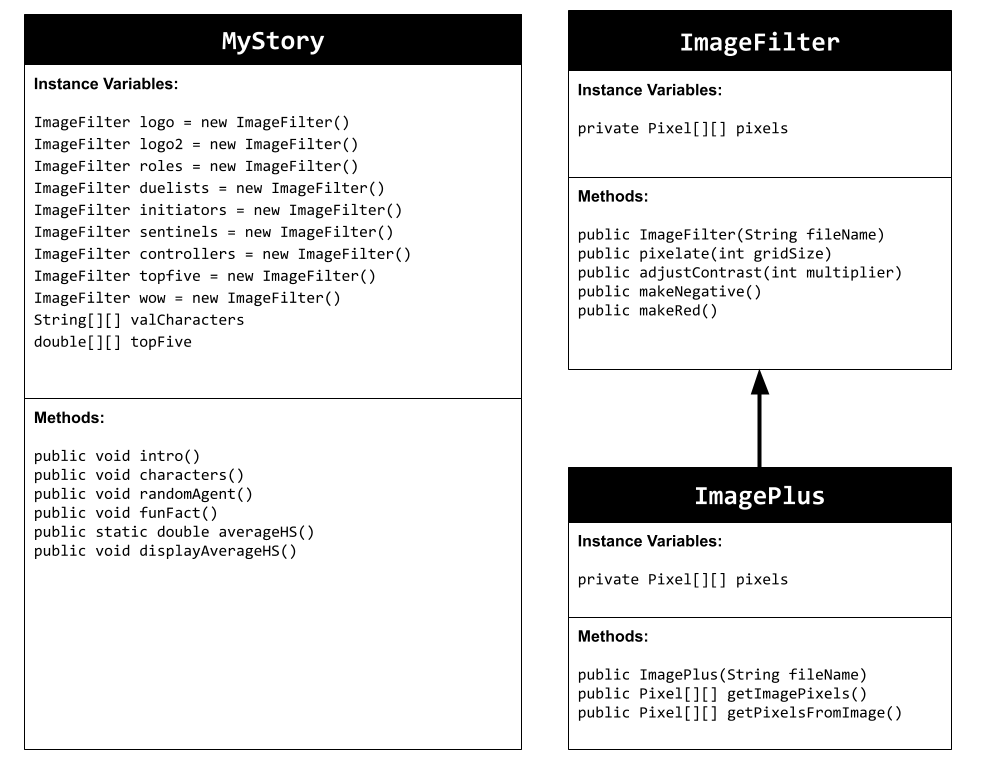

# Unit 5 - Personal Narrative

## Introduction

Images are often used to portray our personal experiences and interests. We also use image filters and effects to change or enhance the mood of an image. When combined into collages and presentations, these images tell a story about who we are and what is important to us. Your goal is to create a personal narrative using The Theater that consists of images of your personal experiences and/or interests, incorporates data related to these experiences and/or interests that can be organized in a 2D array, and uses image filters and effects to change or enhance the mood of your images.

## Requirements

Use your knowledge of object-oriented programming, two-dimensional (2D) arrays, and algorithms to create your personal narrative collage or animation:

- **Create at least two 2D arrays** – Create at least two 2D arrays to store the data that will make up your visualization.
- **Implement one or more algorithms** – Implement one or more algorithms that use loops and two-way or multi-selection statements with compound Boolean expressions to analyze the data.
- **Use Image Filters** - Include multiple image filters learned from this unit, and additionally create new ones of your own.
- **Use methods in the String class** – Use one or more methods in the String class in your program, such as to determine whether the name of an image file contains specific characters.
- **Create a visualization** – Create an image or animation that conveys the story of the data by illustrating the patterns or relationships in the data.
- **Document your code** – Use comments to explain the purpose of the methods and code segments and note any preconditions and postconditions.

## UML Diagram

Put and image of your UML Diagram here. Upload the image of your UML Diagram to your repository, then use the Markdown syntax to insert your image here. Make sure your image file name is one work, otherwise it might not properly get display on this README.

## Video

Record a short video of your story to display here on your README. You can do this by:

- Screen record your project running on Code.org.
- Upload that recording to YouTube.
- Take a thumbnail for your image.
- Upload the thumbnail image to your repo.
- Use the following markdown

## Story Description
My story I decided to showcase the characters/agents of valorant and each of their role. I first showed the 4 different roles that you can play. Next I showcased each role with their group of agents you can select from. Following that was the agent of the day which spits out a agent. In addition I added a fun little fact from the top five valorant players of what their average headshot % was all together. For my 2D array I have the agents separated by their different roles such as initiators, duelists, sentinels, and controllers. For my other 2D Array I separated each row by the top five players and each column is different such as their KD, DMG per Round, and their Headshot %. The methods I used to incoporate these 2D arrays was a random agent selector which takes a random index from row and column and then prints out a random agent for the agent of the day. Next method I used was to calculate the average headshot percentage so I did was get the third column from each row and added the percentages together and divided it by five to get my average headshot percentage.

## Image Filter Analysis

Choose at least 2 filters uses in your animation to explain how the pixels are modified. If you created a new image filter that was not one of the ones from this unit, make sure to explain and analyze that filter(s) before choosing ones that came from this unit.

For one of the filters I decided to adjust the contrast. So in my method it traverses through each pixel and at each pixel it will take the current RGB values and take the multiplier varaible that is inputter through the parameter of the method and multiple each RGB value by that multiplier and adjust the contrast. It then makes the picture much brighter. Next another filter I did was making the Image red. How this filter works is it elimimates the blue and green values by multplying by zero and then intensifies the red value giving the whole image a red tint and making the whole image red